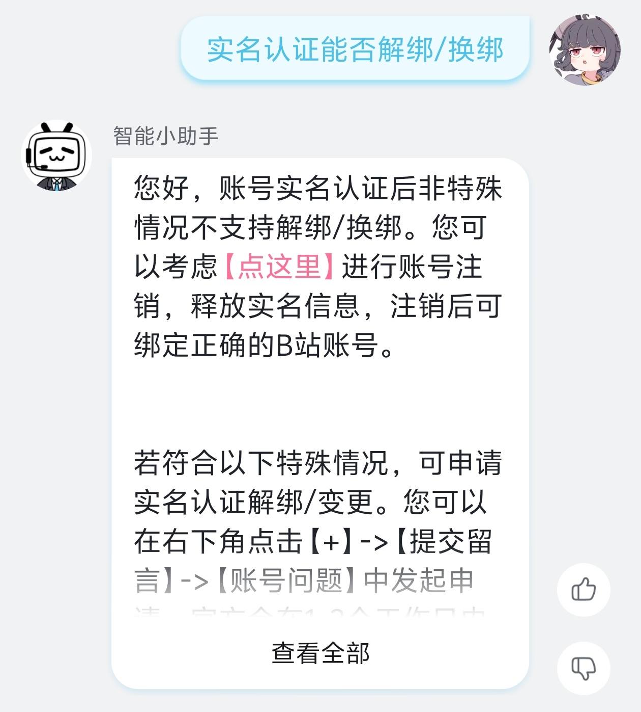

> B 站不支持直接换绑，于是有了这篇文章。

我准备把账号的实名信息切换到新的账号上，发现无法直接换绑

## 注销后才能换绑？

直接发动鬼脑，如果先注销，马上换绑，再取消注销不就可以了

对，没错，就是这么简单直白。
注销之后有三天冷静期，在这期间重新登录就可以取消注销了

贴一下 [知乎的问题](https://www.zhihu.com/question/326474707) 除了换绑，里面可能有一些你想要的答案。
